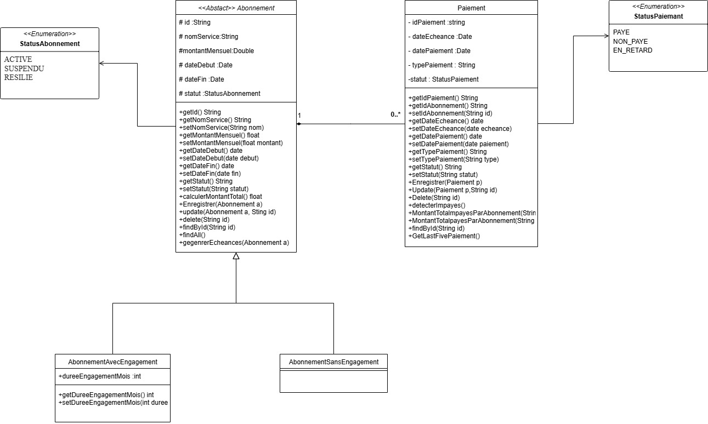

# Subscription-Manager
# 📌 Subscription Management System

## 📖 Project Context
La gestion des abonnements est devenue une préoccupation quotidienne.  
Ce projet vise à centraliser la gestion des abonnements personnels et professionnels en offrant une visibilité sur :
- Les échéances
- Les paiements manqués
- Les coûts réels et prévisionnels

Les utilisateurs comme les responsables financiers pourront suivre facilement leurs abonnements, anticiper leurs budgets, et générer des rapports financiers.

---

## 🏗️ Application Architecture

Le projet suit une architecture en couches :

- **Couche présentation (UI/Menu)** : interface textuelle (console) pour la navigation.
- **Couche métier (Services)** : logique applicative (échéances, impayés, rapports).
- **Couche entity** : objets persistants (`Abonnement`, `Paiement`).
- **Couche DAO (JDBC + PostgreSQL/MySQL)** : communication avec la base de données.
- **Couche utilitaire** : gestion des dates, formatage, validations.

---

## 📂 Project Structure


---

## 📌 Entities

### Abonnement (abstract)
- `id` (UUID)
- `nomService`
- `montantMensuel`
- `dateDebut`, `dateFin`
- `statut` (enum: `ACTIVE`, `SUSPENDU`, `RESILIE`)

#### AbonnementAvecEngagement
- Hérite de `Abonnement`
- + `dureeEngagementMois`

#### AbonnementSansEngagement
- Hérite de `Abonnement`
- Pas d’attribut supplémentaire

### Paiement
- `idPaiement` (UUID)
- `idAbonnement`
- `dateEcheance`, `datePaiement`
- `typePaiement`
- `statut` (enum: `PAYE`, `NON_PAYE`, `EN_RETARD`)

---

## ⚙️ Services

### AbonnementService
- Créer, modifier, supprimer, résilier un abonnement
- Générer des échéances

### PaiementService
- Enregistrer, modifier, supprimer un paiement
- Détecter les impayés
- Générer des rapports financiers (mensuels, annuels, impayés)

---

## 🗄️ Database Schema

### Abonnement
| Column               | Type    |
|-----------------------|---------|
| id                    | UUID    |
| nomService            | String  |
| montantMensuel        | Double  |
| dateDebut             | Date    |
| dateFin               | Date    |
| statut                | Enum    |
| typeAbonnement        | String  |
| dureeEngagementMois   | Int     |

### Paiement
| Column        | Type    |
|---------------|---------|
| idPaiement    | UUID    |
| idAbonnement  | UUID    |
| dateEcheance  | Date    |
| datePaiement  | Date    |
| typePaiement  | String  |
| statut        | Enum    |

**Relation :** `Abonnement 1..n Paiement`

---

## 🖼️ Class Diagram



---

## 🖥️ Features

- Créer, modifier, supprimer des abonnements (avec/sans engagement).
- Lister les abonnements.
- Enregistrer et gérer les paiements.
- Afficher les paiements d’un abonnement.
- Consulter les paiements manqués avec total impayé.
- Afficher la somme payée par abonnement.
- Afficher les **5 derniers paiements**.
- Générer des **rapports financiers** (mensuels, annuels, impayés).

---

## 🛠️ Technical Requirements

- **Language** : Java 8
- **Persistence** : JDBC + PostgreSQL
- **Paradigms** : Programmation fonctionnelle (Stream API, Lambda, Optional, Collectors)
- **Architecture** : En couches (UI, Services, DAO, Utilitaires)
- **Exception Handling** : try/catch + messages clairs
- **Versioning** : Git

---

## 🚀 Getting Started

1. Clone the repository:
   ```bash
   git clone https://github.com/username/subscription-management.git
